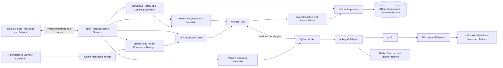

# Development Plan 01: A Lightweight Windows Desktop Downloader

**Documentation reviewed: 9 October 2026; current app: 0.2.10.** The delivered foundation and current controls are described in the README. Later owner-selected platform, external-tool and security decisions supersede conflicting original proposals; planned features remain unimplemented.

Start with the [complete installation and user guide](../README.md). See [current verification](scope-and-lifecycle-0.2.10.md) and [documentation/cleanup record](documentation-and-cleanup-0.2.10.md) for current evidence and retained historical boundaries.

**Current architecture - 0.2.10:** gallery-dl and FFmpeg are external user-installed tools, excluded from the new installer. See [licensing and setup](licensing-and-external-tools.md). Older bundled-tool, no-Python and unresolved-source statements below describe their recorded earlier builds; they do not apply to the new payload or clear old installers.

**Repository/release preparation (8 October 2026):** MIT licensing, current-payload notices/source review, source/ignore auditing and host installer lifecycle are complete. Source publication is a separate next action; signing follows it. Optional hardware/prerequisite/soak expansion is outside the current scope. Portable delivery and signed updates remain future work. See [current release readiness](release-readiness.md).

**Working name:** SavedDesk  
**Created:** 3 October 2026  
**Updated:** 4 October 2026: SavedDesk 0.2 implementation of native account connection, engine downloads, durable SQLite jobs/history, duplicate policies, media details/previews, and basic video conversion.  
**Status:** The functional desktop milestone and current 0.2.7 verification are complete within the owner-selected scope. The design below retains future targets and historical decisions; it does not turn excluded or optional tests into present publication gates. See [verified progress](implementation-progress.md).  
**Next cycle:** [Development Plan 02](development-plan-02.md) covers future features, reliability and encrypted storage. Public-link and isolated account-boundary testing passed; the owner handles further private-content testing.

**Historical starting point:** two standalone Instagram/X CLI scripts and their `gallery-dl` / `yt-dlp` integration. The obsolete root scripts, cookie exports, root requirements and CLI archive folder were retired on 5 October 2026; the maintained desktop worker uses `backend/pyproject.toml`.

## 1. Product direction

Build a Windows desktop application for downloading, organizing, searching, and revisiting Instagram saved posts and collections and X bookmarks. Give it the visual rhythm of a media application: a persistent sidebar, a searchable library, clear collection pages, and an always-visible activity bar.

Spotify is an interaction reference for navigation, hierarchy, and browsing. SavedDesk should have its own name, artwork, icons, colors, and component designs. Its persistent bottom bar represents downloads, rather than music playback.

The main promise is: **save your collections, find your downloaded content, and keep your computer responsive.** SQLite records successful downloads so the app can recognize existing content, ask before deliberate repeat downloads, and offer an Instagram collection update that downloads newly added content.

Video users can select download resolution, preserve the original stream, remux into a compatible container, or explicitly create an encoded version with a saved configuration. Account connection reuses the user's chosen browser/profile session; the desktop frontend provides no cookie-file upload or session-token/ID entry fields.

The intended audience includes people who do not understand download engines, codecs, session storage, or databases. Successful setup, understandable results, actionable recovery, and reliable storage handling are initial-release requirements. The usability findings approved for this plan are mandatory implementation and validation work; they are not a backlog of optional enhancements. Advanced capabilities remain available without making technical decisions prerequisites for ordinary downloads.

Performance is a release requirement. A polished interface should remain usable on a dual-core computer with limited RAM, integrated graphics, and a hard drive. Styling, image previews, and background tasks must fit explicit resource budgets.

“Any hardware capable of running Windows” spans incompatible operating systems and architectures. This plan defines a testable initial baseline and a separate compatibility lane. Performance numbers below are proposed acceptance targets, not results already achieved. A claim of better performance than Spotify requires measurements on the same machines and clearly identified workloads.

## 2. Existing project and migration requirements

The current project consists of two Python scripts, requirements, documentation, local cookie files, and downloaded-content folders. The scripts already provide browser-cookie extraction, exported-cookie authentication, archives, metadata, video options, simulation, and interactive setup.

The Instagram script has 603 lines; the X script has 570. Their download functions combine configuration, credentials, filesystem changes, subprocess execution, and presentation. These responsibilities must become reusable services before a desktop interface depends on them.

| Existing behavior | Desktop migration requirement |
| --- | --- |
| Separate scripts with repeated helpers | Extract shared authentication, settings, tool discovery, and engine adapters. |
| Console prompts and printed results | Replace GUI-facing output with typed commands and structured events; retain CLI wrappers. |
| X `--limit` sets `extractor.twitter.limit` | Add a real total-post limit. The existing option controls results per API request. |
| X text-only flag without a text writer | Add an explicit post-level text writer with independent archival and indexing. |
| FFmpeg fallback adds a directory containing a versioned executable to `PATH` | Discover and pass an actual executable path, and validate that it runs. |
| Resolution selection can require merging without FFmpeg | Select formats using tool capabilities and enforce the requested cap, including 2160p. |
| MP4 cleanup searches only the first 100 KB for signatures | Use stream inspection and reversible quarantine; preserve uncertain files. |
| Dependencies checked before argument parsing | Make help and settings inspection work without importing download engines. |
| Simulation creates directories | Define simulation as network extraction without changes to media, archives, or the persistent catalog. |
| Cookie files alongside source | Keep existing files untouched and out of the desktop sign-in flow; connect through a selected browser/profile session instead. |
| Video options primarily select engine formats | Separate source resolution selection, remuxing, encoding profiles, and durable processing outcomes. |

These findings come from the code review and mocked checks, not authenticated end-to-end downloads. Upstream documents [Twitter query limits](https://gdl-org.github.io/docs/configuration.html#extractor-twitter-limit) and [text-only metadata emission](https://gdl-org.github.io/docs/configuration.html#extractor-twitter-text-tweets). Verify total-post handling with the installed engine and multi-page fixtures; [the command-line reference](https://gdl-org.github.io/docs/options.html) includes `--post-range`, which is a candidate to validate rather than assume sufficient for every bookmark/quote combination.

Preserve existing filenames, media, metadata, and archives during migration. Keep the current script entry points working until desktop parity is demonstrated.

## 3. Technology decision

### Recommended stack

| Layer | Proposed technology | Reason |
| --- | --- | --- |
| Frontend | Next.js App Router, React, and TypeScript; production static export | Component-based screens and routing, packaged as local HTML/CSS/JavaScript. |
| Styling | Tailwind CSS with shared design tokens | Consistent layouts, themes, responsive sizing, and accessible interaction states. |
| Browser authentication | Supported local session adapters plus a permissioned companion browser connector | Reuse the selected browser/profile's authenticated session without manual cookie files or tokens. |
| Windows desktop host | Tauri 2 with Rust and Chromium-based Microsoft WebView2 | Native window/system integration and restricted commands for local services. |
| Presentation | Feature modules, typed bridge, and bounded React state | Keep screens separate from downloads, storage, and credential handling. |
| Download worker | A packaged, pinned CPython environment | Reuse the project's existing Python engines and platform knowledge. |
| Download engines | Tested versions of `gallery-dl` and `yt-dlp` | Retain extraction, authentication, archives, and video handling. |
| Local catalog, download history, and queue | SQLite through Rust `rusqlite`, with a bundled tested SQLite build | Successful-download records, duplicate decisions, collection snapshots, indexed queries, and recoverable jobs. |
| Credentials | Native-only session handling; optional current-user DPAPI cache | Protect browser-derived session material without exposing it to React. |
| Media tools | Explicit FFmpeg and FFprobe paths with validated codec/device capabilities | Merging, inspection, resolution conversion, remuxing, audio extraction, and controlled encoding. |
| Transport | Typed Tauri commands/events for the frontend; versioned JSON Lines for the Python worker | Separate UI privileges from engine execution without a production HTTP server. |
| Delivery | Tauri Windows installer, exported frontend assets, and directory-based Python worker | No Node.js, Rust toolchain, or user Python installation required to run the app. |

The frontend uses Next.js as a build and UI framework. `next build` creates local assets in `out/`; the packaged app loads them through Tauri's local asset origin. Node.js is a development/build dependency, and no Next.js server runs in the production app. Tauri documents [Next.js static-export integration](https://v2.tauri.app/start/frontend/nextjs/).

Use Client Components for interactive library, queue, settings, and confirmation screens. Load desktop APIs after mounting so prerendering does not access `window` or native APIs. Build-time Server Components may provide a static shell, but runtime SSR, Server Actions, and server-dependent API routes are outside this export configuration. Use fixed screen routes and query parameters/client state for user-created post and collection IDs. Never prebuild routes for a user's private library. [Next.js export capabilities and limitations](https://nextjs.org/docs/app/guides/static-exports).

Starting configuration for the frontend:

```ts
// desktop/next.config.ts
import type { NextConfig } from "next";

const config: NextConfig = {
  output: "export",
  images: { unoptimized: true },
};

export default config;
```

Set `frontendDist` to `../out` in `desktop/src-tauri/tauri.conf.json` and use the local Next.js dev server only during development. Verify route reloads, CSS/chunk URLs, fonts, and asset origins in a packaged offline build. Backend-generated thumbnails replace a runtime Next.js image optimizer. Tailwind compiles during the frontend build; keep its tokens and utility usage compatible with the selected WebView2 baseline. [Tailwind browser compatibility](https://tailwindcss.com/docs/compatibility).

The language boundaries add packaging and protocol work. Keep TypeScript responsible for presentation, Rust for catalog, download-history decisions, scheduling, and Windows integration, and Python for extraction/downloading. A rewrite of platform extractors is outside the initial scope. Tauri uses Chromium-based WebView2 on Windows; measure its associated processes rather than assuming a smaller installer guarantees lower RAM usage. [Webview architecture](https://v2.tauri.app/reference/webview-versions/).

### Alternatives considered

| Alternative | Assessment |
| --- | --- |
| Electron with the same exported frontend | Fallback if bundling a controlled Chromium version becomes necessary. Rebenchmark all host, renderer, and worker processes before adopting it. |
| React with Vite | Simpler frontend build alternative if Next.js export/routing complexity becomes a measured obstacle. |
| Native Windows UI or Qt Widgets | Reconsider only if the webview architecture cannot meet the agreed low-hardware requirements. |
| C++ / Win32 | Consider only if profiling proves the selected shell cannot meet required budgets; development and accessibility work would increase. |

These are project choices, not universal speed rankings. Framework choice alone cannot guarantee low memory or fast startup. The selected Next.js/Tailwind/TypeScript frontend must pass the same budgets as the previous native-shell proposal.

## 4. Compatibility and measurable budgets

### Initial support matrix

| Lane | Target | Release treatment |
| --- | --- | --- |
| Primary | Windows 11 x64 editions currently supported by the selected runtime | Full functional and installer testing. |
| Low-hardware baseline | Windows 10 Enterprise LTSC 2021 / 21H2 x64, dual-core CPU, 2 GB RAM, integrated graphics, HDD | Required performance gate on a real machine or representative physical equivalent. |
| Additional compatibility | Windows 10 22H2 x64 | Separate test lane; do not imply vendor runtime support merely because the application launches. |
| Later architecture | Windows ARM64 | Publish only after the Python worker, native SQLite components, and media binaries pass native architecture tests. |
| Outside initial release | Windows 7/8/8.1, 32-bit Windows, and machines below the validated baseline | Investigate separately if demand warrants a maintained build. |

Check the combined Tauri, WebView2, Tailwind browser-feature, Python, and media-tool requirements before freezing this matrix. Record and enforce the minimum tested WebView2 runtime and Chromium feature level in the installer. Older OS/browser combinations that can launch the shell are not automatically supported. The desktop and worker must support the same deployment lane.

### Proposed low-hardware acceptance targets

| Measurement | Target |
| --- | --- |
| Cold start to usable library shell, HDD | p95 at or below 5 seconds. |
| Warm start to usable shell | p95 at or below 2 seconds. |
| Idle total private bytes | At or below 150 MiB after 60 seconds settled; Python worker stopped. |
| Idle CPU | Below 1% average over 60 seconds, normalized across logical processors. |
| Ordinary active download private bytes | At or below 400 MiB combined across the shell and all app-owned worker/tool processes on the defined benchmark. |
| Local navigation and filter feedback | p95 at or below 150 ms; show feedback immediately while results load. |
| Indexed local search, 50,000 posts | First results p95 at or below 300 ms. |
| List scrolling | p95 frame duration at or below 33 ms at 1366 x 768 with bounded visible thumbnails. |
| Stop button feedback | At or below 100 ms; acknowledgement of intent is separate from process termination. |
| Worker retirement | Within 30 seconds after queue activity ends. |
| Thumbnail memory cache | Maximum 16 MiB in low-resource mode; 64 MiB in standard mode. |
| Download concurrency | One active job globally by default; one in low-resource mode. |
| Thumbnail concurrency | One decoder/generator in low-resource mode. |
| Video processing concurrency | One FFmpeg task globally by default; no simultaneous encoding and thumbnail generation in low-resource mode. |
| Software encode threads | One worker thread initially in low-resource mode; bounded codec/filter pools and measured overrides. |
| Installed size | Aim for at most 250 MiB for the base build; report the media-tool bundle separately. |

The active-download budget applies to progressive 720p transfers and ordinary muxing fixtures. Encoding is an explicit additional workload: measure a separate 720p H.264 processing fixture against the same 400 MiB total-process target, then record high-resolution/hardware-codec results separately. Limit threads, concurrent work, and buffers; reject or defer unsupported profiles rather than letting optional conversion make the shell unusable. Large manifests, unusual files, and high-resolution processing are not universally bounded. Suspend thumbnails under pressure. Preserve original media by default; never silently transcode a download.

Measure private bytes, working set, CPU, disk activity, and responsiveness separately. The memory budget includes the Rust host, all associated WebView2 renderer/GPU/utility processes, Python, and FFmpeg; do not report only the host process. An external browser is unnecessary for local library browsing and should not launch during these benchmarks. Report the shared WebView2 runtime installation size separately from the base app. Keep existing targets provisional until the packaged webview prototype measures them; renegotiate failed budgets explicitly rather than presenting them as achieved.

Use release builds outside the debugger, fixed datasets, recorded OS/build/hardware details, and at least 30 startup runs. Report cold and warm cache conditions separately. If comparing with Spotify, report its exact version and comparable shell startup/idle workloads; downloading social content is a separate workload. Tune or change the design when budgets fail before publishing performance claims.

## 5. Interface and interaction design

### Application shell

Use a conventional resizable Windows window with reliable minimize, maximize, snap, and keyboard behavior. The initial minimum size is 760 x 520 device-independent pixels. Below 900 pixels wide, use a compact sidebar and a details dialog instead of a permanent right pane.

```text
+--------------------------------------------------------------------------+
| SavedDesk                                         Windows window controls |
+-------------------+------------------------------------------------------+
| Library           | Search your library...               Add download     |
| Instagram Saved   +------------------------------------------------------+
| X Bookmarks       | Library                              Sort / Filters   |
| Downloads      3  | Instagram / X / Images / Videos / Text               |
|                   |                                                      |
| Collections       | [Preview] Creator   Caption...    Saved date   Open   |
|   Recipes         | [Preview] Creator   Caption...    Saved date   Open   |
|   Design          | [Preview] Creator   Caption...    Saved date   Open   |
|                   | [Preview] Creator   Caption...    Saved date   Open   |
| Accounts          |                                                      |
| Settings          | Selected item: metadata and file actions             |
+-------------------+------------------------------------------------------+
| Downloading: X Bookmarks   24 saved / 8 skipped   2.1 MB/s   Pause   Stop   |
+--------------------------------------------------------------------------+
```

The list is the first implementation because predictable row heights simplify virtualization. Add an optional tile view only after its virtualized row/panel implementation passes the same dataset and memory tests. A normal wrapping panel that creates every item is not an acceptable gallery implementation.

### Visual language

- Dark background `#111418`, surface `#1B2026`, and elevated surface `#252C34`.
- Main text `#F2F5F7`, secondary text `#A9B4C0`, and accent `#26C6B1`.
- Use distinct warning and error colors plus text/icons; color alone never communicates state.
- Use Segoe UI or the available Windows system UI font, a restrained type scale, an 8-pixel spacing rhythm, and simple vector icons.
- Keep surfaces mostly opaque with modest corner rounding. Avoid continuous animation, blur, and large translucent shadows.
- Validate actual text/background contrast to WCAG AA thresholds; the palette is a starting point, not a completed accessibility audit.
- Respect high contrast, reduced motion, display scaling, and keyboard focus. Test 100%, 125%, 150%, and 200% scaling.

### Main screens

| Screen | Required behavior |
| --- | --- |
| Library | Search downloaded captions, creators, and tags; filter by source/type/collection; open files, reveal folders, or visit original URLs. |
| Instagram Saved | Choose an account and saved posts or a collection; when previously downloaded, choose new items, everything again, or cancel. |
| X Bookmarks | Choose an account, total-post limit, video quality/profile, quoted-post behavior, and text preservation. |
| Downloads | View queued, active, paused, delayed, interrupted, and finished jobs; retain readable completion reports, file locations, and retry-failed actions. |
| Accounts | Select browser/profile, reuse its logged-in session, verify the account, reconnect, or disconnect. |
| Settings | Choose destination, move/relink stored files, back up/restore library information, manage privacy and notifications, install updates, and configure video/resource/network policies and close-window behavior. |

The library is local-first: opening it never fetches remote timelines. Collections unavailable through the tested extractor can be added using their URL. Do not promise automatic remote collection enumeration before the engine proves it supports it.

### First-run and common flows

1. Open an immediately usable local library shell, even offline.
2. Select a download location using the Windows folder picker.
3. Add Instagram or X, choose an installed browser, and choose the profile/container where the user is already logged in. Remember that choice per account.
4. Press **Connect using this browser**. Where needed, authorize the companion connector in that browser once; reuse its existing session without a cookie upload, pasted token, or repeated password entry.
5. Check account access with an explicit bounded request. Show the verified username and browser/profile, or offer **Open browser to sign in** / **Retry connection**. Never claim the user is connected based only on finding a cookie database. For standard Instagram sessions, verify the authenticated self-account username once and bind the accepted token's numeric owner to its scoped browser account-ID cookie; require agreement with any server-returned ID. Do not force a separate profile lookup when this verified binding is available. Keep stable numeric identities for account history and repeat the authenticated check before downloads; unsupported/ambiguous sessions must not bypass verification.
6. Select a source and press **Download**. Check SQLite download history and show the repeat-download choice when applicable before starting media transfer. Keep detailed engine options under **Advanced**.
7. Show saved/skipped/failed counts and the current item. When the total is unknown, use an indeterminate indicator rather than an invented percentage.
8. Downloaded files become searchable as catalog updates arrive. The library remains usable during a download.

Make browser-session reuse the required desktop authentication path. Direct reading is capability-dependent; a permissioned browser connector is the path for supported browsers whose session storage cannot be read directly. Extension installation/authorization may be a one-time prerequisite, not a claim of zero setup on every browser. Keep legacy CLI authentication isolated; do not surface cookie-file, token/ID, or account-password fields in the desktop application.

Double-clicking a video opens the default Windows player. Inline image preview is lazy and bounded. Autoplay and an embedded video player are deferred so a library view does not create decoding workloads.

Define the total-post limit as the first N source saved posts/bookmarks encountered during the run, including items already in the archive. Quoted posts and card assets attached to those source posts do not consume additional source-post slots. A carousel consumes one slot and may produce several media files. Label the advanced setting **Posts to check** so users do not interpret it as a promise to download N new files. Prove this policy across pagination and quoted-post fixtures before exposing the control.

For collection updates, a limited or interrupted scan must not replace the last complete collection snapshot or claim that everything new has been checked. Give users a clear **Check the entire collection** option; the full-collection choice defaults to no post limit.

Define empty, loading, offline, expired-session, disk-full, missing-file, and partial-success states. Use messages such as “Reconnect your account,” “Choose another folder,” and “Try again after 14:30,” with details available on demand.

Provide Ctrl+F for search, Ctrl+N for a new download, normal Tab/Shift+Tab navigation, accessible control names, and a visible focus indicator. Never hide an essential action in a hover-only control.

### Required usability behavior

These requirements apply the researched guidance to SavedDesk; the sources support the design principles and documented failure cases, rather than proving usability for this particular application. Validate the resulting flows with the intended audience in Section 11.

| ID | Requirement | Required behavior and acceptance evidence |
| --- | --- | --- |
| UX-01 | Setup ends in a usable result | Retain completed setup steps through failures. Guide folder selection, browser connection, first download, and opening the result; readiness checks prevent known failures. |
| UX-02 | Simple everyday controls | Show content, verified account, destination, video quality, and one primary download action. Preserve originals by default; technical controls have contextual help under Advanced. |
| UX-03 | Recognizable collections | Display previously used collections by name, account, bounded thumbnail, last complete check, and last successful download, with Update collection. A partial check never appears as No new items found. |
| UX-04 | Readable completion reports | Persist saved/already-available/unavailable/failed results with Open folder, View saved content, and Retry failed items. Distinguish posts, assets, and file versions. |
| UX-05 | Actionable errors | Classify failures, explain them in ordinary language, and offer the applicable recovery action without discarding successful work. |
| UX-06 | Storage management | Provide Move download folder and Locate moved files. Detect unavailable drives, permissions, and space problems; preserve identity/history and make moves recoverable. |
| UX-07 | Network and power handling | Persist waiting reasons; handle disconnect/reconnect and sleep/wake; respect metered-network choices and support pausing conversion on low battery. |
| UX-08 | Backup and restore | Create bounded scheduled catalog backups and user-operated export/restore flows. Clearly distinguish library information from media backup; never export credentials. |
| UX-09 | In-app updates | Check, download, verify, and install tested signed releases when idle; preserve library data and recover from failed upgrades. |
| UX-10 | Account and privacy clarity | Explain browser/profile access and Disconnect; separate clearing cache, removing records, and deleting media, with explicit consequences. |
| UX-11 | Observed usability | Test realistic core tasks with nontechnical participants; resolve blocking problems and repeat affected tasks before release. |
| UX-12 | Useful notifications | One completion or actionable-problem notification per job, contextual actions, OS quiet-mode behavior, and private previews by default. |
| UX-13 | Specific confirmations | Use explicit action names, safe initial focus, and one scoped collection decision; retain repeat-download consent. |
| UX-14 | Accessible changing status | Announce important status changes without stealing focus or announcing every progress tick; preserve usable keyboard navigation and zoom. |
| UX-15 | Contextual help and safe resets | Explain unfamiliar choices where used; Restore default video settings changes only video defaults and preserves queued-job snapshots. |
| UX-16 | Readable troubleshooting | Provide a copyable, redacted problem summary and attempted fixes alongside the existing explicit diagnostic export. |

#### Setup, defaults, and collection recognition

Readiness checks run off the renderer thread and cover a writable destination, available storage, supported packaged components, and verified account access. Probe the selected folder with a uniquely named app-owned temporary file and remove it; never alter existing media. Explain missing prerequisites and offer the applicable installer repair, browser authorization, Reconnect, or Choose another folder action. Preserve completed setup steps, allow access to the local library without connecting, and do not silently start the first download.

Keep codecs, encoder threads, post-check limits, and other engine-specific settings under Advanced. Explain quality, compatibility, processing time, and storage consequences beside relevant controls. Original/preserve remains the default, with no hidden conversion. Restore default video settings requires a visible preview of the affected defaults, does not change accounts/history/media, and does not modify already queued jobs. Follow [progressive disclosure guidance](https://www.nngroup.com/articles/progressive-disclosure/) and [error prevention and contextual help principles](https://www.nngroup.com/articles/ten-usability-heuristics/).

Render remembered collection names and checks from SQLite without network access. Update collection uses the recorded target/account, proposes Download new items, and retains the repeat confirmation policy. Discover remote collections only when tested engine support exists; otherwise guide URL entry and identify the resolved target before downloading. Say No new items found only after complete discovery; partial/limited/failed checks remain distinguishable. [Recognition rather than recall](https://www.nngroup.com/articles/recognition-and-recall/).

#### Completion reports, errors, and assistance

Persist reports derived from item outcomes, including a display such as **42 posts saved · 18 already available · 3 unavailable · 2 failed**. If a post is partly saved, classify it as partial rather than claiming completion; show file totals separately. Include new versus restored results, conversion outcomes, and whether discovery checked the entire target. A successful download never masks conversion failure. Reports remain available after restarting the app and provide Open folder, View saved content, and Retry failed items. Show known progress and estimates honestly; use indeterminate status when totals are unknown. [Microsoft progress guidance](https://learn.microsoft.com/en-us/windows/apps/develop/ui/controls/progress-controls).

Retry failed items creates a linked, restricted recovery attempt under the original job's validated scope/settings, preserving its archive lineage and completed copies. It must not turn a failed all-again run into another full repeat. Permanent unavailable items are not automatically retried; offer Check again only on user request. Recheck destination, account, and duplicate policy before recovery starts. A stale authorization or changed target/settings requires the corresponding confirmation.

Map classified failures to plain explanations and actions: expired connection -> Reconnect; unwritable folder -> Choose another folder; missing drive -> Wait for drive / Choose another location; full disk -> Free space / Choose another location; temporary outage -> Wait / Retry; rate limit -> a known retry time or an honest waiting message; platform incompatibility -> Check for updates; unavailable content -> explain that the source cannot currently provide it. Keep engine codes and trace details under Show details. [W3C error-suggestion guidance](https://www.w3.org/WAI/WCAG22/Understanding/error-suggestion.html).

Provide Copy troubleshooting summary with error category, app/engine versions, job stage, time, and attempted fixes. Redact session material, signed URLs, local username/path details, and private captions/account identifiers by default; preview the summary before export. Diagnostic files remain an explicit action and no support information is sent automatically. An established downloader's [troubleshooting workflow](https://www.4kdownload.com/troubleshooting/troubleshooting-howto-fix-parsing-and-downloading-issues) documents version changes, folder access, and support context as practical failure/recovery concerns; do not replicate instructions to weaken browser or operating-system protections.

#### Notifications, confirmations, and accessibility

Use native completion and attention notifications only when useful, normally while the app is in the background. Group by job, update/remove resolved attention notifications, and navigate to the relevant result or recovery screen when activated. Offer contextual actions such as Open folder or Reconnect; do not reconnect or authorize downloads solely from notification activation. Respect OS Do Not Disturb and the user's notification setting. Default notifications omit private account names, captions, and thumbnails. No notification is generated for each file. [Microsoft notification guidance](https://learn.microsoft.com/en-us/windows/apps/develop/notifications/app-notifications/app-notifications-ux-guidance).

Use Download new items, Download everything again, Delete downloaded files, and Cancel rather than ambiguous Yes/No buttons. Make destination, bandwidth/copy consequences, and deletion scope visible before confirmation. Reserve blocking dialogs for decisions that require them; use one scoped collection choice, not a prompt for each duplicate post. Dismissal cancels and focus returns to the initiating control. [Microsoft dialog guidance](https://learn.microsoft.com/en-us/windows/apps/develop/ui/controls/dialogs-and-flyouts/dialogs).

Expose important completion/error/waiting messages through appropriate accessible status roles without changing focus. Announce stage transitions and meaningful results, not every byte counter. Essential controls have text or accessible labels, remain reachable at 200% UI zoom, and are not obscured by the activity bar or dialogs. Keyboard focus and dialog return behavior are verified in the installed app as well as web tests. [W3C status messages](https://www.w3.org/WAI/WCAG22/Understanding/status-messages.html) and [focus visibility](https://www.w3.org/WAI/WCAG22/Understanding/focus-not-obscured-minimum.html).

### Video configuration and profiles

Expose **Video quality** and **Output profile** in the download dialog. Put encoder-specific settings in an expandable **Advanced video settings** panel. Profiles have friendly names and an explanation of their speed, compatibility, and output behavior. Save global defaults, optional per-source defaults, and job-specific overrides; snapshot the resolved profile into each job so changing Settings does not change work already queued.

| Control | Required options and behavior |
| --- | --- |
| Source download quality | Original/best available, 2160p, 1440p, 1080p, 720p, 480p, and 360p, restricted to formats the extractor can identify. Show available dimensions when known. |
| Output operation | Preserve original, remux without re-encoding, or encode a new version. Original is the initial default. |
| Container | Original, MP4, MKV, or WebM only when compatible with the selected codecs. Validate combinations before queueing. |
| Video codec | Copy existing stream; H.264 baseline encoding; HEVC or AV1 only when the distributed build and a tested device/encoder support them. Unsupported options are disabled with an explanation. |
| Output dimensions | Keep source size or choose an orientation-aware maximum resolution. Preserve aspect ratio, rotation/display orientation, and even dimensions where the encoder requires them. Upscaling is off by default. |
| Frame rate | Keep source timing by default; explicit 24/25/30/50/60 fps conversion when requested. Do not promise frame-rate conversion without encoding. |
| Encoding quality | Encoder-specific quality mode or target video bitrate. For software H.264, expose validated CRF settings and speed presets. Do not treat CRF/CQ values as interchangeable across encoders. |
| Audio | Preserve the source track where compatible; AAC/Opus conversion with bitrate/channel/sample-rate choices when needed; mute or extract audio as an explicit operation. Audio preservation is the default. |
| Hardware acceleration | Auto, software, or an available validated device/encoder. Probe usability, not merely whether an encoder name exists in FFmpeg. |
| Additional operations | Accurate trim start/end, container remux, audio-only extraction, and one bounded preview thumbnail. Preserve originals and write new artifacts. |
| Resource controls | Maximum processing concurrency, CPU thread budget, and pause/stop behavior. Low-resource mode starts with one encoding task and bounded threads. |

Treat source selection and output encoding as separate stages. A resolution choice first tries an available source stream at or below the cap. Do not silently download a larger source or use an unrestricted best-format fallback. If no compliant stream exists, show **Download available quality and resize** only when the user explicitly selects encoding; explain that this downloads the available source and adds processing. Remuxing changes the container without reducing resolution or re-encoding quality.

Interpret resolution presets consistently for portrait and landscape footage: a 720p preset fits within 1280 x 720 for landscape and 720 x 1280 for portrait, with aspect ratio preserved. Do not classify portrait 720 x 1280 as landscape 1280p. Resolve rotation metadata before applying the output bound. Unknown source dimensions cannot be advertised as satisfying a strict cap; obtain trustworthy metadata or ask the user to select the available source/processing alternative.

Starting profile definitions:

| Profile | Configuration | Expected tradeoff |
| --- | --- | --- |
| Original | Best selected source quality, original codec/audio, no resize/re-encode | Fastest processing and preserves delivered source quality; file size depends on source. |
| Compatible MP4 | H.264, AAC where audio exists, MP4, up to 1080p, source timing | Broad player compatibility; remux/copy when already compliant, otherwise explicit encoding. |
| Smaller file | H.264, MP4, up to 720p, CRF 23 and `veryfast` as initial software defaults | Smaller dimensions and tunable quality; output size is not guaranteed. |
| Hardware fast | Validated H.264 hardware encoder and its own quality preset, compatible MP4/audio | Can reduce CPU load on supported devices; quality and speed must be measured. |
| Custom | Saved validated codec/container/resolution/audio/rate-control configuration | Advanced control with a clear summary and resource estimate. |

Keep defaults provisional until benchmark fixtures determine the best quality/speed balance. Software H.264 requires an FFmpeg build with the chosen encoder (for example, libx264); encoder distribution and license obligations must be recorded. HEVC/AV1 availability, hardware support, and player compatibility are separate capability checks. FFmpeg documents [codec options](https://ffmpeg.org/ffmpeg-codecs.html); map frontend settings to an allowlisted argument builder rather than accepting arbitrary shell arguments.

HDR source preservation remains available under Original. An SDR-compatible conversion requires an explicit tone-mapping configuration and a tested color pipeline; never produce a dark/miscolored file by silently dropping HDR metadata. Generic HDR-to-SDR conversion is deferred until fixtures pass. Accurate trimming and frame-rate changes may require decoding/encoding; explain that cost. Audio extraction uses a supported audio codec/container and is distinct from downloading Instagram background music.

### Video progress and outcomes

Display separate stages: **Discovering formats**, **Downloading**, **Merging**, **Encoding**, **Verifying**, and **Ready**. Show download bytes/s for transfers and processed duration/estimated remaining time for encoding only when measurements permit. A downloaded source can be ready even when its requested conversion fails; label that result **Original saved; conversion failed** with **Retry conversion** and **Open original** actions.

When a valid source file is already local, offer **Create configured version from existing file** instead of transferring it again. If the source lacks the quality required for the requested profile, explain the need for another download and apply the existing confirmation policy. Encoding options are not permission to repeat the network download silently.

## 6. Architecture and process lifecycle



### Ownership rules

- The Rust host owns queue persistence, catalog/download-history writes, account storage, confirmation validation, and scheduling. SQLite access runs on background repository tasks, never the webview rendering thread. The Python worker does not write `catalog.db`.
- React accesses narrow typed commands such as `prepare_download`, `confirm_download`, `search_library`, `list_browsers`, `connect_browser`, `list_video_capabilities`, `process_existing_video`, and `cancel_job`. Browser commands return connection status and verified identity, never session secrets. Expose neither arbitrary SQL nor unrestricted filesystem/process commands to the frontend. Validate arguments again in Rust.
- The Python worker owns one download attempt and the associated engine archive. Start a fresh process per job to isolate global engine configuration and credentials.
- Import heavy Python modules only after the worker starts. The shell must never start Python just to display a local library.
- Download engines retain responsibility for requests, retries, stream selection, partial files, and archive formats. The app adapts these features rather than inventing a second downloader.
- Deliver UI updates in small batches and update only subscribed React state. Pipe reading, database access, inspection, and thumbnail generation run outside the renderer; expensive client transforms use a web worker when justified by profiling.
- Load trusted packaged frontend assets, apply a restrictive Content Security Policy, scope native capabilities and media-file access, and prohibit remote navigation in the privileged application webview. Render captions as text, and open validated source URLs in the external browser.
- Place the worker and descendants in a Windows Job Object and test process-tree cleanup. Use a create-suspended/assign/resume sequence or equivalent launcher to avoid children escaping before assignment. Microsoft documents [Job Objects and process-tree termination](https://learn.microsoft.com/en-us/windows/win32/procthread/job-objects).

### Worker protocol

Use JSON Lines with `protocol_version`, `job_id`, `run_id`, and monotonically increasing `sequence` fields. The worker sends a capability/version handshake before accepting work. Reject incompatible protocol versions with a specific diagnostic.

Commands include `discover`, `start`, `item_decision`, `item_recorded`, `process_media`, `probe_capabilities`, `pause_at_boundary`, and `cancel`. Events include `accepted`, `started`, `post_discovered`, `inventory_completed`, `item_ready`, `item_progress`, `item_completed`, `processing_started`, `processing_progress`, `artifact_completed`, `processing_failed`, `item_skipped`, `retry_scheduled`, `auth_required`, `paused`, `completed`, and `failed`. A worker asks the host for a transfer decision before writing a known item; bounded batches avoid one unbounded in-memory inventory. Acknowledge completion with `item_recorded` only after the host commits the catalog result; repeated completion events are idempotent.

Persist `download_mode`, confirmation scope, and any repair option in the job. Rust supplies the worker with a validated transfer policy, never a renderer-controlled raw force flag. Discovery may fetch metadata to identify posts, but must not transfer media, mutate engine archives, or silently mark files as downloaded.

```json
{
  "protocol_version": 1,
  "job_id": "job-123",
  "run_id": "run-1",
  "sequence": 42,
  "event": "item_completed",
  "data": {
    "post_id": "123456",
    "media_index": 1,
    "relative_path": "creator/123456_1.mp4",
    "bytes_written": 1048576
  }
}
```

Reserve stdout for protocol messages and stderr for bounded, redacted diagnostics. Explicitly redirect engine prints/progress output away from protocol stdout. Read both streams concurrently to avoid pipe deadlocks. Validate frames, cap ordinary event size at 256 KiB, cap native-only browser session payloads at 1 MiB, and reject oversized inputs before parsing. Separate private authentication results from ordinary events and prohibit forwarding them to the webview/event log.

Generate events from tested engine hooks/postprocessors, not terminal-text scraping. Those integration points may be version-sensitive: isolate them in adapters, pin dependencies, and prove download/skip/error/cancellation events in the first technical spike. If required hooks are unavailable, adjust the engine adapter before committing to fine-grained UI features.

Coalesce progress at no more than four updates per second. Keep terminal and completion events lossless, persist them promptly, and apply backpressure when their bounded queue fills. Drop intermediate progress updates under pressure. Store large captions/metadata as sidecars rather than unbounded pipe messages.

### Queue and recovery

Persist job settings and destination before launching the worker; store an account reference rather than credentials in the job. Use this state flow:

```text
Preparing -> Discovering -> Ready / NeedsConfirmation -> Queued
Queued -> Starting -> Running -> Completed / CompletedWithErrors / Failed
Running -> PauseRequested -> Paused -> Queued
Running -> RetryScheduled -> Queued
Running / Queued -> Waiting(reason set) -> Queued when policy permits
Running / Starting -> CancelRequested -> Cancelled
Any active state after a crash -> Interrupted -> Queued or Cancelled by user
Authentication failure -> NeedsAuthentication -> Queued after reconnect
```

Preparing/Discovering/NeedsConfirmation describe a preflight draft, not permission to transfer media. Cancelling it never creates a queued transfer. The host rechecks existing downloads when a job actually starts so another job cannot invalidate the preflight decision.

Pause requests finish the current safe item boundary, close engine resources, and stop the worker. Display “Pausing after this item” until acknowledgement. Resume uses the archive appropriate to the persisted mode, including the isolated archive for an explicitly repeated-download job, so files already finished in that job are skipped. Byte-level partial-file resume depends on engine/server support and is not guaranteed.

Cancellation requests cooperative shutdown first, then terminates the process tree after a five-second grace period. Preserve partial files using engine behavior and never announce completion for an unfinished item. A terminal state is persisted before the UI treats it as durable.

Do not retry authentication failures or permanent missing content. Bound transient retry attempts and respect engine rate-limit delays. Use one retry owner per failure to avoid multiplying engine retries with app retries. Never run two jobs against the same source/account archive simultaneously.

After a crash, reconcile completed sidecars and files against recorded events and the engine archive. Deduplicate by stable keys; do not redownload an entire library to rebuild the catalog. Offer **Resume interrupted jobs** rather than automatically starting network work on launch.

Closing with active work offers **Keep running in tray**, **Pause and exit**, or **Cancel and exit**. Persist the chosen behavior. Tray operation runs the same application process without a visible window; an always-running Windows service is outside scope.

### Network, power, and destination policies

Rust owns an event-driven Windows connectivity/cost and power monitor while relevant work exists. Apply these policies to the existing Python/FFmpeg workers; do not assume they inherit Windows Background Transfer behavior or replace authenticated engine execution with that API. Microsoft documents [connectivity, metered cost, and power considerations](https://learn.microsoft.com/en-us/windows/apps/develop/networking/background-transfers).

- Persist distinct wait reasons for internet, metered connection, destination availability, insufficient space, and low battery. Show the reason and recovery action beside the job. Multiple blockers may coexist; resuming requires all applicable blockers to be resolved.
- On connectivity loss, stop new network requests and transition to Waiting for internet through a safe boundary or bounded interruption. Preserve completed/partial artifacts and archive lineage. Once connectivity returns, automatically resume only previously authorized active work paused by that condition, after access/destination checks; manually paused, cancelled, auth-blocked, or crash-interrupted work remains under user control. Do not promise byte-level resume.
- Do not start or continue new transfers on a known metered connection without an applicable explicit choice. Continue on this connection can authorize the current job; saving a broader preference is a separate visible choice. Unknown network cost is shown as unknown rather than misrepresented as unmetered. Changes during transfer take effect at the safe boundary.
- Handle suspend/resume without holding stale connections or duplicating completed work. Offer Pause conversions on low battery, enabled by default, using the OS low-battery indication. Preserve source files and resume according to the saved policy after power recovers. Interrupted active encoding may need to restart its current artifact; explain this. Never prevent system sleep indefinitely by default.
- Before starting or resuming, check destination accessibility and available space; account for temporary merges, retained originals, and derived output. Pause before a known insufficient-space operation. When size cannot be established, label it unknown, retain a configured safety reserve, and handle actual disk-full errors without marking success. Recheck during long jobs at a bounded cadence, not on each UI update.

These policies reuse the queue and shared resource scheduler. Retire monitors and workers when no relevant work remains; network recovery must not create a permanent background service or fetch collections on launch.

### Video processing lifecycle

1. Probe source media with FFprobe and resolve the selected source-quality and output-profile policies before invoking FFmpeg. Validate container/codec/audio/dimension combinations and estimate required free space without promising an exact final file size.
2. Persist a processing task referencing the original artifact and a snapshot of validated settings. Build the FFmpeg argument list from typed settings and allowlisted options, run without a shell, and use absolute tool/input/output paths.
3. Copy streams or remux if the profile is already compatible. Otherwise perform the explicitly selected encode/trim/audio operation, with bounded threads/filter pools and a tested codec/device. Cache capability results against FFmpeg version and device/driver identity; revalidate after changes.
4. Write a unique partial output on the destination volume. Use FFmpeg machine-readable progress, drain diagnostic output concurrently, and report bounded progress events. Do not mark a conversion successful just because the source download finished.
5. FFprobe the result for expected stream types, dimensions, codecs, duration within the operation's tolerance, and required audio. Finalize it with an atomic same-volume rename where supported, then commit its catalog record. [FFprobe documentation](https://ffmpeg.org/ffprobe.html).
6. Retain the original and sidecars. A failed/cancelled conversion leaves source success intact and records processing failure independently. Remove only the app-owned partial conversion file; never delete the original in recovery or cleanup.
7. Pause encoding between artifacts by default; stop can terminate the active FFmpeg process. Do not promise byte-level encoding resume: retry a stopped conversion from its original source and skip already finalized derived artifacts.

One shared resource scheduler accounts for downloading, engine muxing, encoding, probing, and thumbnail generation. In low-resource mode, serialize expensive media work and suspend thumbnails during conversion. Hardware encoder failure becomes a visible recoverable state; offer software fallback instead of silently changing the profile and CPU load. Fallback consent/settings are recorded for that processing job.

## 7. Storage, indexing, and account protection

### Filesystem layout

```text
Application installation/
  SavedDesk.exe
  frontend assets/         # packaged Next.js static export
  desktop dependencies/    # native host dependencies; WebView2 prerequisite
  worker/                 # packaged Python runtime and engines
  tools/                  # approved media-tool package, when included

%LOCALAPPDATA%/SavedDesk/
  catalog.db
  settings.json
  credentials/            # encrypted session blobs
  cache/thumbnails/
  logs/
  backups/                 # consistent library snapshots; private user data
  state/archives/<source>/<account-id>/
  state/repeat-jobs/<job-id>/  # isolated archive for deliberate repeat runs
  quarantine/

<user-selected download folder>/
  instagram/<account>/<creator>/<collection>/...
  x/<account>/<creator>/...
  re-downloads/<job-id>/<source>/<account>/...  # deliberate repeat copies
```

Resolve Windows known folders through the OS; never hardcode the user's drive or profile path. Default media storage to a SavedDesk folder inside Downloads. Keep media separate from application cache and credentials. Uninstalling the program must preserve media unless the user explicitly chooses otherwise.

Use logical internal account IDs to avoid exposing session values in paths. In v1, prefer local disks for catalog and engine archives; network destinations need a separately tested locking/recovery policy.

### Storage management and recoverable moves

Always show the current save location in download review and completion reports, with Open folder. Changing the default destination affects future jobs only; it does not silently move existing files or reinterpret old history. Offer Move download folder separately from Locate moved files, with a preview of affected files, space requirements, and destination. Download-directory permissions are a documented [downloader failure case](https://www.4kdownload.com/troubleshooting/troubleshooting-howto-fix-parsing-and-downloading-issues).

Use stable media-root IDs and relative paths. For a move, pause work using the affected roots, persist an operation journal, copy in cancellable bounded batches without overwriting unrelated files, and verify copies before committing new locations. Keep sources until the new catalog mapping is durable; remove only verified app-managed originals as part of the explicitly confirmed move. Journal cleanup too, so a crash/cancel/drive disconnect does not lose the only valid copy or leave an untracked destination. Recovery offers finish or rollback while preserving verified media and history. Account archives stay in the application state directory and are not reset by a media move.

Locate moved files uses a user-selected directory and bounded matching by relative path, expected identity/type/size, with deeper verification where ambiguous. Do not match solely by filename or accept out-of-root paths. Show unresolved items; successful relinking updates availability and root mappings without transferring media. Distinguish temporarily unavailable drives from confirmed missing files, and do not automatically redownload an offline drive's contents. Wait for drive and Choose another location preserve completed items; moving versus saving remaining items elsewhere is an explicit choice.

### Library backup and restore

Create automatic consistent catalog/settings snapshots after changes at most once per day while idle, retaining the latest three successful scheduled snapshots plus the pre-upgrade snapshot until upgrade validation succeeds. Run through the resource scheduler, not a startup-blocking copy. Explain backup location, disk usage, last success, and failures; preserve the last valid snapshot if a new one fails. Use user-restricted local storage and never delete user-created exports through retention cleanup. [SQLite online backup](https://www.sqlite.org/backup.html) supplies a consistent database snapshot; copying an open catalog.db alone is insufficient with WAL.

Provide Back up library information and Restore library information with a preview stating that history/settings are included, downloaded media is not, and browser accounts will require reconnection on another installation. Export a versioned manifest, a validated sanitized catalog snapshot, safe settings, and engine/archive reconciliation metadata captured under the queue's maintenance lock. Preserve stable remote account identities for history but strip browser-profile paths, connector authorization/nonces, session-cache references, and all credential material. Archive formats must be understood and verified secret-free before inclusion; otherwise rebuild supported skip state from restored catalog outcomes through the tested adapter. Never export credentials or temporary session files. Explain that the export still contains private library information.

Restore with workers stopped and an exclusive maintenance lock. Validate the package version, paths, manifest, schema, and database integrity in staging; make a consistent backup of the current library before replacement. Preserve the current state on validation/migration failure. Restore remembered locations as unverified until located/checked, reconnect accounts explicitly, and reconcile unfinished jobs instead of replaying network work automatically. If the live database is corrupt, keep its original files and offer Restore backup with clear scope; never silently initialize an empty library. Backup/restore covers library metadata, not disaster recovery for media files stored on the same failed drive.

### Catalog model

SQLite is both the searchable catalog and the authoritative application record of download outcomes. It is required for the initial desktop release, not an optional library enhancement. Engine archives are a secondary engine-level skip mechanism and are reconciled with this record; an archive entry alone does not prove that a local file still exists.

| Entity / table | Essential fields |
| --- | --- |
| `accounts` | Internal ID, source, remote account ID when verified, display name, browser-connection/session-cache reference, last verification state. |
| `browser_connections` | Browser family/installation, native-only profile/container/store reference, selected provider, user-authorized scope, verified account ID, last validation/status. No raw cookies or tokens. |
| `collections` | ID, account ID, stable remote collection ID/canonical target key, display name, last complete inventory ID, last successful download time. |
| `posts` | Account/source/native ID, creator, caption, canonical source URL, posted/saved dates, indexed timestamp. |
| `collection_posts` | Collection ID and post ID, first-seen/last-seen inventory IDs, membership state; a post may belong to multiple collections. |
| `media` | Post ID, stable asset key or tested media index, kind, variant/quality, expected metadata, source or derived role. |
| `media_files` | Media ID, destination root, relative path, producing job/item/task ID, bytes, finalization time, availability, source-parent reference, normalized settings fingerprint, probed stream metadata, optional checksum. Multiple successful versions may coexist. |
| `media_roots` | Stable root ID, resolved directory, volume identity where available, accessibility state, last validation. Referenced by stored artifacts and job destinations. |
| `storage_operations` | Move/relink operation ID, affected root IDs, approved scope, staged file mappings, verification/commit/cleanup checkpoints, recovery state. Large journals are paged. |
| `video_profiles` | ID/name, versioned codec/container/size/frame-rate/audio/rate-control settings, resource policy, default scopes. |
| `processing_tasks` | Source artifact ID, resolved profile/settings fingerprint, operation, status, actual encoder/device/tool version, output artifact ID, error/progress/timestamps. |
| `download_jobs` | ID, source/account/target, validated settings including source-quality and output-profile snapshot, `download_mode`, confirmation scope/time, repair option, state, wait reasons, network/power policy, destination, archive reference, recovery-parent reference. |
| `download_items` | Job ID, post/media/variant identity, item state, outcome, bytes, error classification, completion time. |
| `collection_inventories` | ID, collection/job ID, started/finished time, complete/partial/failed state, source-post count, applied limit/cursor. |
| `inventory_posts` | Inventory ID and post ID; staged membership observations until a complete scan is promoted. |
| `job_attempts` | Run ID, job ID, engine versions, outcome, bounded diagnostic reference. |
| `library_backups` | Snapshot ID, creation time, schema/app version, manifest path, validation status, scheduled/manual/pre-upgrade role. No credentials. |
| `schema_versions` | Applied migration version and time. |

Use uniqueness constraints on `(source, account_id, native_post_id)`, `(account_id, canonical_collection_key)`, `(collection_id, post_id)`, `(post_id, asset_key, variant)`, and `(job_id, media_id)`. Reuse an account identity when reconnecting the same verified account. Normalize X/Twitter aliases and Instagram collection URL forms; a renamed collection remains the same target when its remote ID is unchanged. Temporary signed CDN URLs, captions, creator names, and filenames are not duplicate identities.

Keep deduplication within the selected source/account scope in v1. Recognize an existing post across that account's collections and destinations, then show its actual saved location. Do not silently reuse another account's private media. Downloading a higher-quality variant is distinct from an exact existing asset, but the dialog must still explain that the post has a prior download.

Keep raw metadata in existing sidecars and normalize only fields needed for library/history queries. Store timestamps in UTC, displaying them in the user's local timezone. Distinguish source-post counts, asset counts, and file-version counts. A carousel is complete only when all required selected assets for that manifest are successfully finalized; a partially downloaded post is never treated as wholly present.

Store source-download outcomes separately from derived-processing outcomes. A successfully saved source remains successful if an encode fails. Compute a stable fingerprint from normalized output settings (codec/container, dimensions, frame-rate policy, audio policy, rate control, trim range, and pipeline version); retain requested and actual encoder details. Reuse a validated existing derived artifact for the same source/settings unless the user explicitly requests another version. Changed encoding settings must not trigger an unnecessary source redownload or erase the original's history.

Use Rust `rusqlite` with a pinned bundled SQLite build and a dedicated repository task/thread for its blocking operations. Enable foreign keys on each connection, use bound parameters, set a bounded busy timeout, and handle `SQLITE_BUSY` without blocking the renderer. Use WAL on a local database, one serialized writer, short transactions, bounded readers, and indexed/keyset pagination. SQLite permits only one simultaneous writer; design around that limit. [Transactions](https://sqlite.org/lang_transaction.html), [WAL](https://sqlite.org/wal.html), and [rusqlite](https://docs.rs/rusqlite/latest/rusqlite/).

Index successful-item lookup, media availability, account/source/native post identity, collection target identity, and job state. Fetch around 100 rows at a time. Add FTS5 caption/tag/creator search only after verifying it is available in the bundled build. Create search indexes incrementally off the renderer thread. The frontend never receives a general SQL execution permission.

Back up the catalog consistently through SQLite's backup mechanism before schema upgrades. Use transactions for migrations and preserve the prior database on failure. Engine archives remain engine-owned; a file called `archive.txt` is not assumed to be line-delimited text. Inspect its format and let the tested engine manage it.

### Confirmation behavior for previously downloaded content

Perform a fast local history lookup when a user presses **Download**. Resolve an unknown collection/post identity through bounded metadata discovery if necessary. A prior attempt is not the same as a prior successful download: show partial, failed, or interrupted work accurately. Never start duplicate media transfer while a required decision is pending.

| Request | User-facing choice and default |
| --- | --- |
| Single post with the requested assets already saved | **Already downloaded. Download this content again?** Show last successful date and file location. Offer **Open existing**, **Download again**, and **Cancel**. Initial focus is Cancel; never preselect the repeat action. |
| Instagram collection with previous successful or partial downloads | **You have downloaded content from this collection before. What would you like to download?** Offer **Download new items** (recommended), **Download everything again**, and **Cancel**. Show the last complete check and a partial-run notice if relevant. |
| Previously downloaded Instagram all-saved target or X bookmarks | Offer **Download new items**, **Download everything again**, and **Cancel**, using the same history policy. |
| First-time collection containing posts already saved through another collection | After discovery, show an overlap summary and offer **Download missing items**, **Download everything again**, and **Cancel**. Existing files may be linked into the new collection without transferring them again. |
| Previously recorded files that are missing/incomplete | Show **Some files are missing or incomplete** and offer **Download missing items** or repair within the collection choice. Do not describe unavailable files as safely present. |
| Same content already queued/running | Offer **View existing job** and **Cancel**; do not enqueue a competing transfer. A deliberate repeat can be queued after the current job completes and its confirmation is rechecked. |
| Existing video can satisfy a different output profile locally | Offer **Create configured version from existing file**, show the processing cost, or Cancel; do not transfer the source again. If that configured version already exists, offer Open existing, Create another version, or Cancel. |

The collection dialog can initially show historical information. Obtain current counts through metadata discovery and label them unknown until available. Use one scoped choice for the selected collection instead of prompting for every post. Dismissing the dialog is equivalent to Cancel and never authorizes a repeat.

If SQLite cannot be opened, queried, or migrated reliably, explain that download history is unavailable and block new media transfers until it is recovered. Never fall back to an untracked download that bypasses duplicate confirmation. Keep diagnostic and database-recovery actions available; do not silently discard or recreate a populated database.

**Download new items** records newly discovered collection membership and downloads assets not already successfully saved for the selected variant. New membership is measured by stable post IDs, not upload dates: an old post saved into the collection today is still a new addition. A post newly added to this collection but already present in another collection is linked/reused and counted as already available. The dialog includes an explicit **Also restore missing or incomplete files** checkbox, enabled by default and explained; disabling it limits transfers to genuinely new additions. Report restored files separately from new ones.

**Download everything again** deliberately transfers all currently accessible posts in the selected collection, including existing posts. It re-enumerates the remote target; items removed from that collection or no longer accessible are not invented from history or deleted locally. With no post limit it covers the entire current collection. If the user applies a limit, label the result as a limited repeat rather than a complete collection download.

The repeat action must show that it uses bandwidth and creates another copy. Its default destination is a versioned `re-downloads/<job-id>/...` folder under the selected media root, preserving original files. Replacement/overwrite is outside v1. Record additional copies as `media_files` for the same logical media, not duplicate logical posts. If the user selected a new destination, show the existing location and the new location before confirming; **new items** continues to reuse valid files at their recorded location, while a complete new copy requires the repeat choice.

For a batch of individual posts, use one summary dialog for known duplicates and persist an explicit choice to skip existing items or repeat the selected batch. No silent global **Always download again** setting. A deliberately confirmed repeat is remembered for that job's retries/resume, not as permission for future jobs.

### Download modes and duplicate decision pipeline

Use typed modes `new_only`, `missing_only`, and `all_again`, plus the explicit `repair_missing` option. Persist the selected mode, target scope, destination policy, and confirmation time on `download_jobs`; carry the validated policy into worker requests. Every newly created job defaults to avoiding duplicate transfers.

1. Normalize the source/account/target and read indexed SQLite history. Resolve ambiguous identities through discovery without media writes.
2. If the target or selected content has prior successful downloads, show the appropriate dialog. Bind the resulting host-issued confirmation to the target, requested mode, settings, and destination. Treat a stale or mismatched preflight result as requiring a fresh decision.
3. Persist the approved job and acquire the target/account archive lock. Recheck item identities and availability when execution begins and before authorizing each bounded batch. A second application instance must not bypass this check; use a single-instance profile lock.
4. Fetch collection metadata in bounded pages. Store staged inventory membership and use the catalog to classify new, already present, missing, incomplete, and unavailable items. Honor the selected policy before allowing any media transfer.
5. For `new_only` and `missing_only`, reuse known valid files and avoid their network media transfers. Check existence/recorded size off the renderer thread for relevant files. Offer an explicit integrity scan for deeper validation rather than hashing the entire library on every click. A changed quality/asset manifest gets an explicit decision instead of a misleading skip.
6. For `all_again`, bypass both archive-based and existing-filename skip behavior for the authorized target. Use a fresh job-specific engine archive and the versioned output root. Merely adding a confirmation dialog while leaving normal archive/file skipping enabled would fail the requirement. Do not delete or reset the canonical archive to force a repeat.
7. Emit completion only after the worker finalizes a file, required sidecars, and its archive update. Rust verifies the final path belongs to the approved destination and records the item result and `media_files` row in one transaction. Queued, started, failed, or cancelled items never create a successful-download marker.
8. Promote collection membership to a complete snapshot only after successful unlimited discovery. Record partial/failed/limited inventories separately; never infer removals from incomplete pagination. Record successful transfers individually even if the overall job has errors.
9. On retry/resume of an `all_again` job, reuse its job-specific archive so newly created copies are not repeatedly downloaded. Reconcile successful repeats into the normal application history and synchronize canonical engine state using a tested adapter operation. If synchronization fails, retain the successful SQLite record and surface reconciliation work; never erase normal history.

The engine adapter must implement per-item transfer decisions, completion acknowledgement, and selective archive behavior in Phase 0/1. If an archive would suppress a file that SQLite identifies as missing, use a scoped repair policy/archive rather than deleting global skip history. SQLite is the app's decision source; engine archives assist execution and must not override an explicitly approved repeat or repair.

### Correctness and recovery examples

- A collection previously contained A and B; it now contains A, B, and C. **Download new items** transfers C and reuses A/B; **Download everything again** transfers A/B/C into a new versioned destination after confirmation.
- C is already downloaded through a different collection. An update adds its membership and reuses C's file; the UI reports zero new file transfers for C.
- A's carousel has three required files and only two completed. With restoration enabled, download the missing third file; do not mark the post complete after the first file.
- B's file was deleted locally. Mark that artifact missing and offer restoration; its historical successful attempt remains recorded.
- A scan stops after its first page. Preserve the previous complete snapshot; do not claim that unseen members were removed or that no new items exist.
- The process crashes after a file is finalized but before its catalog transaction commits. Reconcile the approved job's files/sidecars and archive on restart, validate them, and upsert idempotently. SQLite and filesystem writes are not one atomic transaction.
- A repeat fails halfway. Keep the original collection intact, record new copies that completed, and resume the same confirmed job without duplicating its finished copies.
- Reconnecting the same account or renaming a collection retains history. A different account remains a distinct download scope.
- A 1080p original already exists and the user chooses a 720p H.264 profile. Create a derived version locally, record its settings, and keep source download history intact; a second identical request recognizes the configured version.
- An encode fails after a successful download. Report source success and conversion failure independently, and retry conversion from the existing source.

### Existing-download import

Scan chosen existing folders in bounded batches, parse known sidecars defensively, and build catalog entries without moving or rewriting media. Ask the user to map imports to an account when metadata cannot determine it. Keep unknown files discoverable rather than assigning invented post IDs.

Create successful-history records only for import artifacts whose identity, expected type, and local availability can be verified. Archive-only records enter an unverified/missing state until files are located. Imported valid content must participate in the same repeat-confirmation policy; an import must not cause accidental redownloads or falsely mark incomplete carousels complete.

Register an existing archive in place after validation and a consistent backup, or migrate using a tested engine-compatible procedure. Changing destination roots and archive policies requires an explicit review of whether existing files will be skipped; avoid silently treating a new empty location as already populated.

### Account clarity, privacy, and data controls

Provide a short, accurate privacy summary alongside a discoverable detailed notice: what platform/browser access is requested, which library data stays local, what network requests occur for downloads/updates, what an export includes, and how to revoke access. Account cards show verified username, selected browser/profile, authorized platform, last check, and actionable connection status. Disconnect removes the app's authorization/cache and stops affected jobs; explain that it preserves media/history and does not log the user out of the browser. [Microsoft privacy guidance](https://learn.microsoft.com/en-us/windows/apps/get-started/best-practices).

Separate Clear temporary files, Remove library records, and Delete downloaded files. Show exact scope and consequences before execution, including whether the duplicate-detection record is retained. Clearing cache never changes history or media. Removing records preserves media and explains the effect on future duplicate recognition; it must not leave engine archives silently overriding the new history policy. Deleting media requires explicit scope and retains a missing/deleted historical outcome so later repair/repeat decisions remain honest. Use reversible removal/Windows Recycle Bin where supported, state when permanent deletion is necessary, and never remove arbitrary neighboring files. Resetting video defaults affects none of these controls. Logs, notifications, support summaries, and export previews obey the same privacy policy.

### Authentication handling

The required desktop experience is **connect with the browser where you are already signed in**. React offers browser/profile selection and connection status, not credentials. The app must not ask users to upload exported cookie TXT files, paste a session token/ID, or enter account passwords. Browser session material still exists internally, but its acquisition and handling belong to native/backend services.

#### User flow

1. Select Instagram or X and press **Connect account**.
2. List detected browser installations and profiles with friendly labels. Suggest the system default browser without assuming it contains the desired account. Do not read session content from every detected browser to build this list.
3. Select the browser and profile/container where the user is signed in. Use a bounded profile-discovery adapter and allow a supported portable/custom profile location through a native picker.
4. Use the supported connection method for that exact browser build/profile. Reuse the session through a local adapter when possible; otherwise guide the user through the one-time companion connector installation/authorization in the selected browser.
5. Verify the session against the selected platform using a bounded request, then show **Connected as @username via Browser / Profile**. Only the verified account identity reaches the frontend.
6. If not signed in, open the platform in the selected browser/profile, let the user complete normal login/MFA there, then retry the connection. Do not open the platform's login page inside the privileged application webview or automate password/MFA entry.
7. Remember the selected connection and its explicit platform scope. Reconnect to the same browser/profile when needed; keep accounts/profiles separate even within the same browser.

Connection states include Not connected, Connecting, Awaiting browser permission, Sign-in needed, Connected, Session expired, Browser unavailable, and Connection unsupported. Distinguish denied permission, locked storage, an expired session, and a platform challenge. Give a specific **Retry**, **Open selected browser**, or **Authorize connector** action rather than showing a raw stack trace.

#### Providers and browser coverage

| Browser family | Planned path | Required validation |
| --- | --- | --- |
| Firefox | Native read-only session adapter; connector when needed | Installed/portable profiles, multiple accounts, containers, session expiry, running-browser behavior. |
| Chrome and Edge | Permissioned connector as the supported path when protected storage prevents native extraction; direct adapter only where verified compatible | Current stable builds, multiple profiles, browser permission policy, native-host registration, and already signed-in account reuse. |
| Brave, Vivaldi, Opera, Chromium | Chromium-family connector/adapters as tested | Browser-specific stores/profile layouts, extension support, policies, and installer registration. |
| LibreWolf, Floorp, Zen | Firefox-family adapters/connectors as tested | Fork-specific profile/container behavior and supported extension/native-message APIs. |
| Other detected browsers | Show capability status; add a provider if its APIs can support session reuse | Do not advertise support based on executable detection or a browser name alone. |

Browser names supported by the original scripts are starting candidates, not proof that every current release can decrypt cookies. `gallery-dl` exposes [browser/profile/container cookie extraction options](https://gdl-org.github.io/docs/options.html). Chrome's Windows App-Bound Encryption can prevent other processes from reading protected session values directly. [Google's explanation](https://security.googleblog.com/2024/07/improving-security-of-chrome-cookies-on.html).

Treat “whichever browser” as user choice across validated providers, with an extensible adapter interface and a published browser/build matrix. Some browsers or managed policies may prohibit both methods. Explain unsupported combinations accurately; do not fall back to the manual frontend authentication methods the user excluded.

#### Permissioned companion connector

For protected browsers, create a small Chromium/Firefox extension that reads only the selected platform's session through browser-supported cookie APIs after an explicit Connect action. Request the cookies permission, native messaging permission, and optional platform host permissions. Do not request all-site cookie access or browser-history/password permissions. Account login remains in the user's already authenticated browser.

Transfer the scoped session directly to a registered local native-messaging host, which communicates with the running Rust application through a user-restricted local channel. Do not send it through a public website, clipboard, URL query, the application's React/webview JavaScript, or an exported file. Chrome documents the [cookies permission/host scope](https://developer.chrome.com/docs/extensions/reference/api/cookies) and [native messaging](https://developer.chrome.com/docs/extensions/develop/concepts/native-messaging); Firefox documents [native messaging](https://developer.mozilla.org/en-US/docs/Mozilla/Add-ons/WebExtensions/Native_messaging).

The extension initiates native messaging within its own browser/profile context. The desktop app records a pending platform connection; the native host returns a scoped request to the extension, and a user action in the browser authorizes completion. Use a short-lived request nonce, protocol version, approved extension origin/ID, platform allowlist, bounded payload size, and current-user channel ACLs. Reject unsolicited, replayed, stale, or mismatched requests. Validate the actual platform account ID before attaching a session to existing history.

Preserve required cookie domain/path/expiry/secure/HTTP-only semantics and explicitly handle the selected store/container/partition context where supported. A companion connector is a permissions-based integration, not a promise that every session is transferable: platform checks, device-bound sessions, browser policies, or missing API capabilities can still prevent use. Do not weaken browser security settings, inject into browser processes, or require administrator rights to obtain a session.

Distribute reviewed browser-specific extension packages with stable IDs and per-user native-host manifests. The installer registers only the necessary host entries; uninstall removes the app's registrations. Browsers prompt for extension installation/permission normally. Store approval and enterprise policy are release dependencies, so a production Chrome/Edge seamless-auth claim requires a packaged connector working in those browsers first.

#### Refresh, storage, and revocation

Acquire sessions on explicit connection and before a queued job when the saved connection needs refresh. An approved connector can refresh a changed session only within the previously authorized platform/profile scope; it may require the browser to be running. Do not keep every browser or connector alive while idle. Validate before resuming auth-failed work, and bound refresh attempts to avoid login loops.

Browser logout, revoked permissions, account changes, and expired sessions pause affected jobs and trigger a reconnect state. A refreshed session for a different account requires an explicit account selection instead of silently assigning that account's downloads to the previous identity. Disconnect removes the app's session cache and stops affected jobs; it does not log the user out of their browser or delete media.

Prefer session-only in-memory material. **Remember this browser connection** stores the browser/profile/provider reference and authorized scope; it does not require caching secret values. Offer an explicit **Allow downloads while this browser is closed** setting only when the provider/session supports an encrypted cache. Encrypt any retained session material in Rust with current-user Windows DPAPI. Microsoft documents [CryptProtectData](https://learn.microsoft.com/en-us/windows/win32/api/dpapi/nf-dpapi-cryptprotectdata). Protection at rest does not protect against a malicious process running as the same user.

Provide session material to the Python worker through a native-only private channel, using in-memory cookie objects when possible. If an engine absolutely requires a cookie-file path internally, use a user-restricted temporary file, delete it in `finally`, and sweep stale app-owned files after abnormal shutdown. This internal engine adaptation never asks the user to upload or manage a cookie file.

Exclude session values from React state, renderer IPC/events, SQLite job rows, command-line arguments, environment variables, crash reports, and logs. Redact signed media URLs in diagnostics. Restrict extracted data to Instagram or X/Twitter as selected; avoid unrelated-domain/session collection. Keep workers, tool paths, and native-host communication under application control. Keep the legacy scripts' manual authentication isolated from the desktop UI.

## 8. Performance implementation rules

1. **Virtualize UI and data separately.** Render only visible React list rows plus a small overscan window, use stable item keys, and keep DOM size bounded. Page database results and unload off-screen data pages. CSS overflow alone does not virtualize a library.
2. **Load the visible screen first.** Defer engine startup, folder scans, thumbnail generation, and index maintenance. Restore only necessary view state.
3. **Decode to display size.** Generate thumbnails at display dimensions in the backend, use scoped local asset URLs, and cancel obsolete requests. Revoke unused blob URLs and dispose image buffers. Do not decode full-resolution photos or send base64 media through IPC for list rows.
4. **Bound caches by bytes.** Use an LRU thumbnail cache and a disk-cache limit of 256 MiB in low-resource mode and 1 GiB in standard mode. Store cache entries by media identity/mtime so invalidation is predictable.
5. **Limit background work.** Run one download job by default, suspend cache generation while a tool-intensive operation runs, and schedule scans in cancellable batches. Restrict any advanced concurrency to independent account/archive pairs after testing.
6. **Use events with batching.** Debounce search by approximately 200 ms, batch catalog updates, and avoid sorting/filtering the complete library in memory.
7. **Keep idle quiet.** Stop workers, watchers, animations, and progress timers when unused. Use one lightweight shared UI progress timer while downloading. No automatic remote synchronization at startup.
8. **Keep media work optional.** Choose progressive video by default on weak hardware. Offer bounded quality presets; when no compliant format exists, explain it instead of silently exceeding the cap.
9. **Do not force garbage collection periodically.** Profile retained objects and oversized buffers, then fix their ownership. Do not disguise memory use with forced working-set trimming.
10. **Keep logs bounded.** Rotate at 5 MiB per file, retain at most five files, and cap the visible log buffer at 500 lines. Export redacted diagnostics on explicit action.
11. **Ship a production frontend.** Code-split optional screens, keep dependencies small, and disable development tooling in release builds. Tailwind styling and Next.js routing do not remove Chromium rendering or React reconciliation costs.
12. **Keep authentication on demand.** Profile discovery does not decrypt sessions. Stop temporary authentication helpers/native connectors when their work ends; avoid a hidden browser launch, global cookie watcher, or perpetual refresh timer.
13. **Budget encoding separately.** Probe and encode through the shared scheduler, bound decoder/encoder/filter pools, and prevent thumbnails from competing with a low-resource conversion. A detected hardware encoder must pass an actual small test before selection.

Low-resource mode enables list layout, smaller caches, one job, one thumbnail task, reduced motion, and external playback. Suggest it on a low-memory device and allow manual override. Changing mode should preserve the same download correctness and core actions.

## 9. Proposed source structure

```text
saved-desk/
  README.md
  development-plans/
    development-plan-01.md
    development-plan-02.md
    implementation-progress.md
    account-connection.md
    development.md
    development-artifact.md
    media-and-storage.md
  desktop/
    package.json
    next.config.ts
    tsconfig.json
    postcss.config.mjs
    public/                  # bundled icons and other static assets
    src/
      app/                   # fixed Next.js screen routes and layouts
        globals.css          # Tailwind entry and shared design tokens
      components/            # shared accessible UI elements
      features/
        library/
        downloads/           # queue and repeat-download dialogs
        collections/
        onboarding/          # resumable setup and readiness results
        support/             # plain problem summaries and contextual help
        accounts/            # browser/profile selection and connection state
        video-settings/      # quality, profiles, capabilities, processing state
        settings/
      lib/
        desktop-bridge.ts    # typed commands/events; browser-test mock
        contracts.ts        # generated/validated contract types
    src-tauri/
      Cargo.toml
      tauri.conf.json
      capabilities/          # least-privilege frontend/native scopes
      migrations/            # versioned SQLite schema and indexes
      src/
        commands/            # validated public application commands
        domain/              # settings, identities, job modes, outcomes
        storage/             # SQLite repositories and transaction owner
        library-maintenance/ # backup/restore and journaled moves/relinking
        system-policy/       # network cost, power, drive, notification events
        updates/             # signed package checks and upgrade recovery
        downloads/           # history preflight and confirmation policy
        collections/         # inventory staging and snapshot promotion
        authentication/      # browser registry/profile discovery/providers
        security/            # optional DPAPI cache and native-message policy
        bin/native_host.rs   # companion connector's local native host
        workers/             # pipes, process host, Job Object lifecycle
        media/               # probes, profiles, processing scheduler, quarantine
      tests/                 # native service/database/worker integration
    tests/                   # frontend components and browser flows
  backend/
    pyproject.toml
    src/social_downloader/
      worker.py              # handshake, commands, structured events
      models.py              # validated settings and event types
      auth.py                # native-only session adapters/worker delivery
      tools.py
      adapters/
        gallery_dl.py        # version-sensitive engine integration
        instagram.py
        x.py
      text_writer.py
      video/
        profiles.py          # validated settings and fingerprints
        formats.py           # source quality selection and capabilities
        processing.py        # FFmpeg argv, progress, verification
      cleanup.py
      cli.py
    tests/
      fixtures/              # synthetic/redacted metadata and protocol data
      test_settings.py
      test_engine_adapters.py
      test_archives.py
      test_download_modes.py
      test_browser_auth.py
      test_video_processing.py
      test_cleanup.py
  contracts/
    protocol-v1.schema.json
    desktop-commands.schema.json
    browser-connection.schema.json  # native-only secret transport contract
    fixtures/
  browser-connector/
    shared/                  # scoped session acquisition/connection protocol
    chromium/                # manifest and browser-store packaging
    firefox/                 # manifest and signed add-on packaging
    tests/                   # permission, profile, expiry, native-host tests
  packaging/
    installer/
    worker/
    licenses/
  benchmarks/
    datasets/
    scripts/
    results/
  .gitignore
```

Create modules when their responsibilities are implemented; do not scaffold empty service hierarchies or a general plugin framework. Share validated contracts/fixtures across TypeScript, Rust, and Python to prevent drift. Commit the frontend package-manager lockfile and `Cargo.lock`; pin the worker's tested dependencies. Ignore runtimes, `node_modules`, `.next`, `out`, Rust `target`, credentials, personal downloads, and benchmark data containing real account content.

## 10. Delivery phases and completion gates

Each phase ends with a reviewable artifact and a measurable gate. Dates should be assigned after the technical spike establishes team capacity and packaging costs.

### Executed milestone: SavedDesk 0.2

The next implementation milestone connects the existing UI to native services: explicit Firefox profile/session connection and browser connector approval; authenticated account verification and Windows DPAPI storage; pinned gallery-dl/yt-dlp extraction with per-file decisions before network transfer; SQLite-backed queue/history with repeat/new-only/missing-file repair; pause/resume/retry/disconnect controls; saved-file details and bounded local previews; source resolution caps and explicit H.264/AAC copies that preserve originals. Settings are copied into jobs. React never receives browser credentials or general filesystem/SQL privileges.

This delivers core functionality across Phases 1–5 while retaining the Phase 0 measurement gates. It does not waive the required setup/readiness, complete collection inventory/import, backup/restore/move, advanced processing, policy controls, diagnostics, delivery, accessibility or usability work below. The [progress record](implementation-progress.md) distinguishes tests against synthetic/local fixtures from real account/browser/hardware acceptance; [connection instructions](account-connection.md) explain the current development connector setup.

### Remaining phase gates

| Phase | Work | Completion gate |
| --- | --- | --- |
| 0. Feasibility and measurement | Package the static frontend; prove worker/duplicate policies, browser-session reuse on Chrome/Edge/Firefox, and a bounded H.264 conversion. Render a 50,000-post library and test process cleanup. | Offline routes and recorded total-process benchmarks; no manual cookie/token input; protected-browser connector works; a repeat creates a second copy; encoding stays responsive. |
| 1. Extract backend and create storage | Repair shared Python logic; create SQLite repositories, history, media roots, operation journals, browser connections, video records, and normal/repeat archive policies. Preserve CLI wrappers. | Migration/regression tests pass; failed download/encode outcomes remain separate; strict quality and simulation contracts pass; consistent backups validate. |
| 2. Functional desktop MVP with confirmation | Implement resumable setup/readiness, simple defaults, browser connection, queue, history preflight, explicit repeat dialogs, incremental collections, X downloads, and completion reports (UX-01/02/04/05/13). | Setup leads to a saved result users can open; both collection modes pass; cancellation starts no transfer; no cookie/token fields; actionable failures and persistent accurate reports. |
| 3. Searchable media library | Implement imports, named remembered collections, complete snapshots, search, lazy previews, move/relink, backup/restore, and distinct data controls (UX-03/06/08/10). | 50,000-post gates pass; partial inventories preserve membership; interrupted moves and failed restores retain valid files/history; exports contain no credentials. |
| 4. Video processing and configuration | Implement profiles, remux/encode/audio/trim, capability detection, progress, local reuse, verification, contextual help, and safe default resets (UX-02/15). | H.264 fixtures pass; unavailable options are disabled; originals survive failures; configured versions are recognized; reset preserves job snapshots and unrelated data. |
| 5. Recovery and resource control | Implement pause/resume, reconciliation, restricted failed-item retries, network/cost/power/drive policies, low-resource mode, quarantine/undo, refresh, tray, and quiet notifications (UX-05/07/12). | No orphaned children or secret leaks; user-paused jobs stay paused; recovered jobs do not duplicate saved work; metered/power policies pass; weak-hardware gates pass. |
| 6. Windows and browser delivery | Package desktop/worker/media tools, WebView2, connectors/native hosts, signed in-app updates, upgrade recovery, privacy notice, and readable diagnostics (UX-09/10/16). | Clean-machine install/update/restore/uninstall and connector authorization pass; invalid updates fail safely; no development runtimes required; support matrix and notices are verified. |
| 7. Release validation | Run hardware, browser, accessibility/dynamic-status, encoding, library-soak, authorized account tests, and iterative observed nontechnical task studies (UX-11/14 and all remaining requirements). | Every UX requirement has acceptance evidence; no unresolved core-task usability blockers; published performance/support results, known limitations, and reproducible artifacts. |

The first coding milestone is Phase 0, not a complete visual shell. It must establish that the packaging and engine-event boundary work on the weak-hardware lane before the application grows.

## 11. Verification strategy

### Automated checks

- Settings validation: invalid browser/profile references, denied connection scope, invalid hostnames, nonpositive limits, negative delays, unwritable destinations, and conflicting/incompatible video settings. Preserve separate legacy CLI argument coverage.
- Format selection: FFmpeg present/absent; progressive/DASH; 360p through 2160p; strict caps; missing compliant formats.
- Extraction fixtures: multiple pages, carousels, quoted posts, text-only posts, repeated IDs, malformed metadata, and partial success.
- Total-post limits: explicitly define whether quoted posts count toward the limit, and test the displayed count against the selected source-post policy.
- Protocol: version mismatch, oversized frames, interleaved stderr, duplicate events, missing sequences, premature worker exit, and backpressure.
- Queue/recovery: persisted transitions, duplicate scheduling, crash between file completion and catalog commit, cooperative pause, cancellation timeout, and archive lock conflicts.
- Filesystem: Unicode/long filenames, moved media, unavailable drives, empty disk, permissions, unexpected sidecars, and resolved-path containment.
- Cleanup: real audio/video fixtures with track information at the end, unreadable media, inspection failure, quarantine, and undo. Preserve intentionally generated audio-only artifacts and originals; an uncertain probe never triggers deletion.
- Credential handling: no cookie-upload/token-entry controls; native-only session transport; redaction; optional encrypted browser-session cache; no secrets in renderer events/job rows; stale internal temporary-cookie cleanup.
- Catalog migrations: consistent backup, interrupted upgrade, transaction rollback, and imported archive compatibility.
- Duplicate confirmation: individual post Open/Repeat/Cancel; dismissed dialogs; collection New/Everything/Cancel; batch overlap; already queued/running work; stale confirmation; and enforcement through native commands.
- Collection updates: old posts newly saved, one post in several collections, remote collection rename, different account scopes, no-new-content runs, reordered pages, and inaccessible/removed remote items.
- File completeness: partial carousels, deleted files, new quality variants, archive-only imports, moved destinations, and restoration enabled/disabled.
- Repeat mode: prove actual network media transfer against a local fixture server despite prior archive entries and existing files; preserve original copies/history; retry/resume does not repeat already finished copies of the same job.
- SQLite durability: uniqueness conflicts, `SQLITE_BUSY`, database unavailable/corrupt states, duplicate worker events, and crash between file finalization and transaction commit. Block new transfers when reliable history cannot be read instead of bypassing confirmation.
- Static frontend: production export succeeds; desktop APIs are never called during prerendering; packaged assets and route reloads work offline; query/client-state IDs need no dynamically generated export routes.
- Browser connection: installation/profile discovery without session scanning; already logged-in reuse; multi-account/container isolation; sign-in/MFA in the selected browser; browser closed/locked/missing states; permission denial, logout, expiry, reconnect, and account identity changes.
- Connector: approved extension IDs/origins, scoped cookie hosts, native-host registration, payload limits, nonce/replay rejection, no session forwarding to React, and deletion of app registrations on uninstall. Use synthetic sessions in automation.
- Video options: 1440p/portrait/rotation/odd-dimension fixtures, strict source caps, no automatic upscaling, preserved frame timing/audio, incompatible codec/container combinations, encoder-specific rate controls, and profile snapshots unaffected by later Settings changes.
- Processing: copy/remux/H.264/trim/audio operations; output stream validation; missing encoders/drivers; hardware test failure; stop/retry; out-of-disk conditions; and atomic finalization/reconciliation.
- Derived history: reuse an existing source without network calls; a repeated identical profile recognizes its artifact; altered settings create a distinct variant; an encode failure never erases source success or records a successful derived artifact.
- Setup/readiness: denied permissions, disconnected drives, missing components, expired connections, retained setup progress, and a first download requiring explicit user action.
- Reports/retries: mixed post/asset outcomes, partial carousels, unknown totals, incomplete discovery, persisted reports after restart, and retries limited to unfinished scope of normal/repeat jobs without another full download.
- Storage maintenance: cross-volume moves, collisions, interrupted copy/verification/commit/cleanup, cancellation, drive identity changes, ambiguous relinking, safe path containment, and no deletion of the only verified copy.
- Backup/restore: scheduled retention, consistent WAL snapshots, manifest/schema validation, failed staging/migration, damaged current library, secret-free exports, missing original media locations, and no automatic execution of restored jobs.
- Network/power: disconnect/reconnect, simultaneous wait reasons, cost changes/unknown cost, job-scoped metered consent, suspend/resume, low-battery conversions, no surprise resume of manual pauses, and no duplicate finalized work.
- Updates: bad signatures, unsupported OS/runtime, download/installation interruption, insufficient space, worker activity at install time, migration failure, and compatible binary/database recovery without loss of user media.
- Privacy/help: independent cache/history/media actions, archive reconciliation after record removal, default-reset isolation, redacted support summaries, and private contextual notifications with duplicate suppression.
- Accessibility: status roles and restrained announcements, focus restoration, explicit action labels, 200% zoom, activity-bar overlap, and keyboard access to every essential action.

Use fake workers and local fixtures for CI. Live platform downloads are opt-in manual acceptance tests using the owner's authorized sessions; never place session data in CI or fixtures.

Use component tests and Playwright browser flows with a typed mock desktop bridge for frontend behavior. Add native Rust integration tests using temporary SQLite databases and fake workers. Test the installed Tauri/WebView2 application separately through the supported Windows automation path; browser mocks alone do not validate native commands, installer behavior, or process lifecycle.

### Performance and usability gates

Measure empty, 5,000-post, and 50,000-post libraries, plus a 100,000-post stress dataset. Include large captions, Unicode creators, missing previews, and repeated collection membership. Benchmark library browsing during a transfer and during catalog ingestion.

Also measure library input/scroll responsiveness during 720p software H.264 conversion on the weak-hardware machine and supported hardware encoding on representative devices. Record quality, elapsed processing time, output size, CPU, GPU, total private bytes, and temperature/throttling behavior where measurable. Browser discovery/connection must leave no persistent background helper when idle; distinguish first-time connector setup from repeat connection time.

Perform repeated navigate/filter/scroll cycles and an eight-hour soak. Memory must settle after caches reach their configured limit rather than grow with each navigation. Verify UI Automation names, keyboard-only use, high contrast, DPI changes, screen-reader announcements, and compact-window layouts.

Use Windows performance traces or equivalent tools to explain slow startup, allocations, disk contention, and rendering stalls. Store benchmark scripts and results alongside release versions. A failed gate must be fixed or explicitly renegotiated before release; it cannot be hidden by changing only the benchmark workload.

### Observed usability release gate

Recruit approximately five nontechnical participants per distinct intended user group for an initial qualitative round; use fictional/local fixtures where possible and owner-authorized accounts only where necessary. Give realistic tasks without step-by-step hints: complete first setup/download, find and open saved files, update a collection without repeating existing content, understand a partial result/retry failures, reconnect an expired account, locate moved media, and restore library information. Include the compact weak-hardware experience and relevant accessibility needs. [NN/g usability testing guidance](https://www.nngroup.com/articles/usability-testing-101/).

Record unassisted completion, time, misunderstandings, wrong-account/destination decisions, accidental repeats, and recovery attempts. Test across the delivery phases rather than waiting for the final release. Fix observed blocking/high-impact problems and rerun affected tasks; release requires no unresolved core-task blockers or observed uncorrected destructive mistakes. Keep a versioned checklist mapping UX-01 through UX-16 to implementation and acceptance evidence. A five-person qualitative study is not a statistically representative success-rate claim; record actual observations and limitations.

## 12. Packaging, maintenance, and release scope

Publish an x64 Tauri build containing the Next.js `out/` assets and a pinned directory-based Python worker. Use Node.js/frontend tools and Rust/MSVC tools only in the build environment. Do not package `next dev`, run `next start`, or require a local Next.js server at runtime. Avoid one-file worker extraction packaging until it proves competitive on HDD startup.

The installer verifies the required WebView2 runtime, provisions it when missing, and checks the pinned frontend's minimum browser capabilities. Offer an offline installer option that contains the required runtime installer; report its extra size separately. The portable ZIP requires a compatible installed WebView2 runtime and explains that requirement instead of failing with a blank window.

Build a per-user installer with Start Menu integration and an optional desktop shortcut, plus a portable ZIP with the same functional files. Portable mode still uses user-scoped protected credentials by default; copying the ZIP does not make encrypted account sessions transferable.

Bundle media tools only after selecting redistribution-compatible builds and recording their exact versions, source, hashes, and notices. If tools are optional, make their absence a visible capability state and support progressive transfers. Produce a dependency manifest, license notices, and checksums for release artifacts.

The encoding-capable distribution includes tested FFmpeg/FFprobe builds and explicit supported encoder profiles. A smaller tools-free package can download progressive media but must label conversion features unavailable. Include required per-user native-host manifests in the installer, link to approved connector packages, and test extension/browser updates against the connection protocol. Portable mode needs an explicit native-host setup step for connector-based browser access; do not promise that copying a ZIP registers a browser integration automatically.

### Required signed in-app updates

Provide Check for updates -> Download update -> Install when idle inside the initial-release app, rather than requiring users to find and run another installer manually. Show version, relevant fixes, compatibility, size where known, and progress. Checking remains explicit initially; installing requires user intent and never interrupts active downloads, processing, moves, or restore. A user can finish work or explicitly pause/exit before installation. Automatic silent installation is not required.

Use the [Tauri updater](https://v2.tauri.app/plugin/updater/) with required artifact signature verification and secured release metadata transport. Validate the supported OS/runtime and available space before installation. Keep app, worker, engines, and media tools in a tested compatibility set; website-change fixes ship as verified releases. Do not run unrestricted pip installs or arbitrary repair scripts on user computers. Component repair uses the verified installer/release workflow, with a clear retry action after failures.

Create consistent pre-upgrade catalog/settings backups under a maintenance lock. Stage and verify the update before applying it; preserve media/history and recover interrupted installation. Keep or reacquire a signed prior package for supported recovery. A binary rollback cannot safely use an incompatible migrated database: coordinate restoration of the matching pre-upgrade state, explain any affected newer library records, and never delete downloaded media. Test update signing and recovery in clean-machine lanes before claiming support. Browser extensions retain their browser-store update/authorization lifecycle; desktop updates do not bypass it.

Keep dependency updates behind adapter tests and account-based smoke tests because platforms and cookie extraction change independently of the UI. Pin a tested compatibility set instead of always installing the latest package. Record versions in diagnostics without session data.

### Initial release includes

- Instagram saved posts and explicit collection targets; X bookmarks.
- Browser/profile-based reuse of already authenticated sessions, including a permissioned connector for validated protected browsers; no manual cookie-file or token/ID frontend workflow.
- A persistent queue with stop, safe pause/resume, retry, and recovery.
- SQLite-backed successful-download history, individual repeat confirmation, and Instagram/X new-items versus deliberate full-repeat modes.
- Local library, search, filters, metadata, bounded image previews, and external playback.
- Video resolution selection, saved profiles, compatible remuxing/H.264 encoding, audio controls/extraction, trimming, validated hardware acceleration, and separate processing progress/history.
- Import of existing downloads, low-resource mode, and Windows installer/portable delivery.
- All UX-01 through UX-16 requirements: guided successful setup, remembered collections, readable results, actionable recovery, storage move/relink, network/power handling, backup/restore, signed in-app updates, clear privacy/data controls, contextual help/reset, quiet notifications, accessible status, readable diagnostics, and observed usability validation.

### Deferred features

- Additional platforms, cloud synchronization, multi-device libraries, and remote access.
- Automatic login/password handling, embedded browser sign-in, and scheduling services.
- Autoplay, inline video playback, full animated GIF previews, unvalidated codec/device combinations, and generic HDR-to-SDR conversion before its color fixtures pass.
- A marketplace/plugin system, large parallel queues, and remote collection discovery without engine support.

## 13. Risks and decision gates

| Risk | Mitigation and decision |
| --- | --- |
| Platform authentication or extraction changes | Pinned adapters, actionable reconnect states, and tested maintenance releases. |
| Protected browser storage blocks direct session reading | Permissioned cookies/native-messaging connector, tested browser/profile matrix, and no manual-token fallback in the desktop UI. |
| Connector store approval or managed browser policy blocks installation | Treat approved packages and browser policy compatibility as release gates; show supported providers accurately. |
| Encoding harms weak-hardware responsiveness or changes media incorrectly | Opt-in conversion, bounded shared scheduler, capability probes, source preservation, and stream/quality fixtures. |
| WebView2 rendering, hydration, effects, or thumbnails overwhelm weak hardware | Small production bundles, flat styling, virtualized DOM/data, bounded decoding, and total-process profiling in Phase 0. |
| TypeScript/Rust/Python boundaries increase complexity | Versioned typed commands and worker protocol, pinned runtimes, shared fixtures, and packaged integration tests. |
| A confirmation dialog does not actually disable duplicate skipping | Separate repeat mode with scoped authorization, isolated archive, versioned output root, and tests proving a second transfer occurred. |
| Partial collection scans or missing files produce false duplicate decisions | Complete-snapshot promotion, per-asset outcomes, availability checks, and explicit restoration choices. |
| Fine-grained events require fragile engine internals | Isolate hooks, pin/test versions, and reduce unsupported progress features before release. |
| Catalog and archives diverge after interruption | Stable IDs, idempotent ingestion, consistent backups, and local reconciliation. |
| A move, restore, or upgrade loses history or the only valid media copy | Exclusive maintenance coordination, journaled verified moves, staged restores, consistent snapshots, and compatible binary/database recovery tests. |
| Connectivity/cost/power changes restart work unexpectedly or consume unwanted data | Persist blockers and consent, resume only eligible authorized work, and test user-pause/sleep/metered transitions. |
| Technical controls or ambiguous results prevent ordinary users from succeeding | Simple defaults, contextual help, explicit scoped actions, persisted reports, and iterative observed core-task testing. |
| User expects universal Windows compatibility | Publish the tested OS/hardware matrix and keep experimental lanes clearly identified. |
| Media tools or unusual manifests exceed resource targets | Progressive defaults, optional processing, bounded concurrency, and distinct stress measurements. |

The immediate deliverable from this plan is a measured, packaged prototype: an accessible shell, a bounded local library, and a disposable worker that reports one job accurately and shuts down cleanly. That prototype determines whether the proposed architecture earns the next implementation phase.


## Updated video storage policy (6 October 2026)

The user has superseded original-preserving video derivatives for new downloads: prefer native H.264/AAC streams, merge/remux without encoding when possible, and keep only the verified playable MP4 after necessary conversion. Failed unfinished sources remain retryable; existing catalog copies retain legacy recovery/deletion support. The compatible-first selector can choose lower resolution than VP9/AV1 maximums. See [current policy and measured limits](media-and-storage.md#download-time-playback-compatibility) and [plan 02 implementation](development-plan-02.md#compatible-only-new-video-downloads-6-october-2026).
